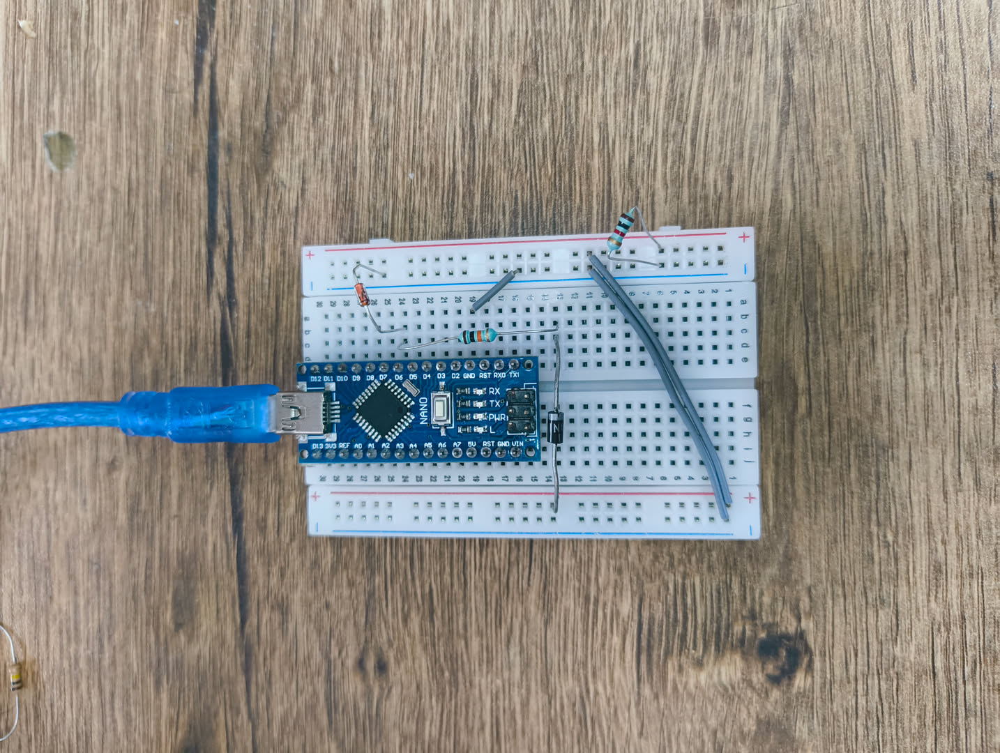
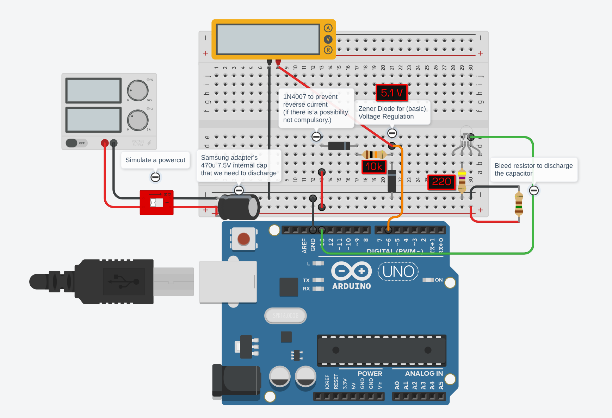

வீட்டுல கரண்ட்டு போச்சுன்னா யாரு எனக்கு சொல்லுவா?

Who will let me know if there is a powercut in my house?

# Currentu Pochino!

**Monitor your homelab power status with an Arduino!** When power cuts out, currentu-pochino detects the state change via a digital input pin and triggers custom on/off actions. Perfect for automated shutdown sequences, logging, notifications, or recovery workflows!

## Overview

This project uses components I had lying around. It uses an Arduino Nano (or compatible board) connected via USB to monitor a digital input pin (for example, from a relay sensing AC mains, or a simple 5V output from a wall adapter!). When the power state changes, the Arduino sends `ON`/`OFF` messages over serial, and a systemd service (a python script) running on your Linux machine executes corresponding shell scripts. \[Sorry Windows/Mac users! You need to do your own work adapting this to your OS.\]

**Features (of the scripts on this repo):**
- Automatic USB device detection and stable `/dev/by-id` path setup
- Systemd service integration for automatic startup
- Configurable actions via shell scripts defined by you (`on.sh`, `off.sh`)
- Simple serial protocol: `ON`, `OFF`, or `HI` (init message)

## Hardware

### Arduino Sketch (`nano.ino`)

- **Sense Pin:** Digital pin 6 (`D6`) – connects to your power sense circuit
- **LED Indicator:** Built-in LED (pin 13) – blinks on startup, shows power state
- **Baud Rate:** 115200
- **Debounce:** 50 ms (firmware debounce)

Upload `nano.ino` to your Arduino board beforehand using the Arduino IDE or `avrdude`!

### Circuit of my setup

I have an old Samsung charger which I use to power the input pin. If power goes out, the charger loses power and stops powering the input pin (though as I have observed, it practically does *not* power down instantly! this is due to there being charged capacitors in the charger's internal circuitry. It took around 30 seconds to discharge to the point that the voltage becomes less than the ATmega328P's Input HIGH level VIH > 0.6Vcc or approximately 3V).



The circuit's schematic on Tinkercad:



KiCad schematic coming soon! (do you really want it?)

## Installation

### Prerequisites

- Linux system (tested on Debian/Ubuntu, should work on any distro that has systemd and python support)
- Arduino Nano or compatible board with USB-to-serial adapter (onboard USB is fine)
- Python 3 with `pyserial` installed (`python3-serial` on apt, `python-pyserial` on ArchLinux extra repo)
- `systemd` for service management
- Root access (to install as service - the service itself runs as your user. You can manually install it completely without root access!)

### Step 1: Prepare Your Scripts

Clone the repository:

```bash
git clone https://github.com/ilamparithi-in/current-pochino
cd current-pochino
```

and create `on.sh` and `off.sh` in the repo directory:

**on.sh** – runs when Arduino detects power ON:
```bash
#!/bin/bash
# Example: Start services, log event, send notification
logger "Power restored on homelab"
# systemctl start myservice
# curl -X POST http://notifier/alert?status=online
```

**off.sh** – runs when Arduino detects power OFF:
```bash
#!/bin/bash
# Example: Graceful shutdown or logging
logger "Power lost on homelab; initiating safe shutdown"
systemctl poweroff  # or: shutdown -h +5  for delayed shutdown
```

Alternatively, you can edit the python listener script to modify the actions performed, they do not need to be a shell script!

### Step 2: Upload Firmware to Arduino

1. Open `nano.ino` in the Arduino IDE
2. Select your board (Arduino Nano) and COM port
3. Click **Upload**
4. Wait for the upload to complete; you should see the startup chime!

### Step 3: Clone the repo and Run Installation Script

```bash
# current working directory: current-pochino/
sudo ./setup.sh
```

The script will:

1. **Auto-detect the Arduino** (requires manual intervention)
2. **Install the listener** – Copies `pochino_listener.py` to `/usr/local/bin/`
3. **Install action scripts** – Copies `on.sh` and `off.sh` to `/usr/local/lib/currentu-pochino/`
4. **Install systemd service** – Configures and enables the systemd unit with auto-detected device paths
5. **Start the service** – Enables auto-start on boot and starts it immediately

**You can override paths and provide the serial path directly to skip auto-detection:**

```bash
sudo ./setup.sh -l custom_listener.py \
    -o /path/to/on.sh -f /path/to/off.sh \
    -d /dev/serial/by-id/usb-1a86_USB_Serial-if00-port0
```

Options:
- `-s <service_file>` – Custom systemd unit file (default: `currentu-pochino.service`)
- `-l <listener_file>` – Custom Python listener (default: `pochino_listener.py`)
- `-o <on_script>` – Custom on-action script (default: `on.sh`)
- `-f <off_script>` – Custom off-action script (default: `off.sh`)
- `-d <serial_path>` – Serial device path (e.g., `/dev/serial/by-id/usb-1a86_...`); if omitted, auto-detected
- `-h` – Show usage

### NOTE

**Using `/dev/ttyUSB0` or `/dev/ttyACM0` as serial path is not recommended as there may be other serial devices (another arduino you may have connected for some reason) that can take the place of your sensing device. Use the `/dev/serial/by-id/...` path instead!**

## Customization

### Modifying the Action Scripts

**Do not edit `/usr/local/lib/currentu-pochino/on.sh` and `/usr/local/lib/currentu-pochino/off.sh` directly!**

In the event of a power loss while you have the device connected and the listener running, an improperly edited action script might cause damage to your system! (depending on the commands you have used)

Please edit the scripts separately and run the install script (or copy them manually using the `install` command) again!

### Adjusting Arduino Debounce

Edit `nano.ino` line 3:
```cpp
const unsigned long DEBOUNCE = 50;  // milliseconds
```

Increase if you see spurious ON/OFF transitions; decrease if response feels sluggish. Re-upload after changes.

### Changing the Sense Pin

Edit `nano.ino` line 1:
```cpp
const uint8_t SENSE_PIN = 6;  // Change to your pin
```

Re-upload to the Arduino.

## Troubleshooting

### Arduino not detected during setup

- Ensure the Arduino is connected via USB
- Check permissions: `ls -la /dev/serial/by-id/`
- Verify USB driver: `lsusb | grep -i "nano\|1a86"`
- Try manually specifying the path: `sudo ./setup.sh -d /dev/ttyUSB0`

### Service fails to start

Check logs:
```bash
sudo journalctl -u currentu-pochino.service -n 100
```

Common issues:
- **"Permission denied"** – The `dialout` group or device permissions may be wrong. Verify: `groups | grep dialout`
- **"Module not found: serial"** – Install pyserial: `sudo apt install python3-serial`
- **"Device not found"** – Arduino unplugged or wrong path; verify with `ls -la /dev/serial/by-id/`

### Arduino keeps sending "HI" on every connection

This is normal. The Arduino resets when the serial port opens (DTR/RTS pulse), running `setup()` again. You can modify the listener script to not print an initialization message every time it detects one, or you can disable auto-reset; custom actions only trigger on "ON"/"OFF".

To disable auto-reset on your Arduino, add a 100nF capacitor between RST and GND (or search the solution for your own board).

### Custom scripts not running

Ensure:
1. Scripts have proper shebang: `#!/bin/bash`
2. Check logs for errors: `sudo journalctl -u currentu-pochino.service`

## Service Configuration

The systemd unit file (`currentu-pochino.service`) is installed to `/etc/systemd/system/` with:
- **User:** `you!!` (if you used the install script, this would've been automatically replaced with your user)
- **Group:** `dialout` (for serial port access)
- **Auto-restart:** On failure, with 15-second delay
- **Environment:** Passes `ARDUINO_SERIAL_PATH` to the Python listener

To edit the service manually:
```bash
sudo systemctl edit currentu-pochino.service
sudo systemctl daemon-reload
sudo systemctl restart currentu-pochino.service
```

## Uninstallation

Things to remove: The systemd service, the action scripts, the listener script, and finally the unit file from `/etc/systemd/system`.

```bash
sudo systemctl disable currentu-pochino.service
sudo systemctl stop currentu-pochino.service
sudo rm /etc/systemd/system/currentu-pochino.service
sudo rm /usr/local/bin/pochino_listener.py
sudo rm -rf /usr/local/lib/currentu-pochino
sudo systemctl daemon-reload
```

***

Helped you in any way? [Buy me a Biriyani :D](https://pseudosmp.github.io/donate)
